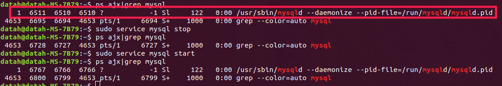
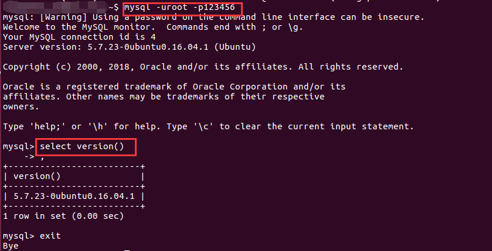

# MySQL安装

## 1 Ubuntu下安装


ubuntu上安装mysql非常简单只需要几条命令就可以完成。

- sudo apt-get install mysql-server  # 安装MySQL服务
- sudo apt-get install mysql-client            # 安装客户端
  注意：安装过程中会提示设置密码什么的，注意设置了不要忘了，安装完成之后可以使用如下命令来检查是否安装成功：如图所示使用

```
sudo service mysql start    # 开启服务
ps ajx | grep mysql    
```
通过如上命令,如果有如下图的红框部分,那么就说明安装MySQL成功.

 登陆mysql数据库可以通过如下命令：
    mysql -uroot -p密码

-u 表示选择登陆的用户名， -p 表示登陆的用户密码，上面命令输入之后会提示输入密码，此时输入密码就可以登录到mysql。

接着通过selct version()获取客户端版本信息，如上图所示。

创建用户和授权：

```
创建用户：
    create user 'hiram'@'192.168.1.1' identified by '123123';
    create user 'hiram'@'192.168.1.%' identified by '123123';
    create user 'hiram'@'%' identified by '123123';
授权：
	权限  人
        grant select,insert,update  on db1.t1 to 'hiram'@'%';
        grant all privileges  on db1.t1 to 'hiram'@'%';

        revoke all privileges on db1.t1 from 'hiram'@'%';
```


**参考文献：[Ubuntu 安装mysql和简单操作](https://www.cnblogs.com/zhuyp1015/p/3561470.html)**

## 2 Windows 下安装

1. 在目录下创建my.ini:

```
[mysql]
# 设置mysql客户端默认字符集
default-character-set=utf8 
[mysqld]
#设置3306端口
port = 3306 
# 设置mysql的安装目录
basedir=D:\\server\\mysql-8.0.21-winx64
# 设置mysql数据库的数据的存放目录
datadir=D:\\server\\mysql-8.0.21-winx64\\data
# 允许最大连接数
max_connections=200
# 服务端使用的字符集默认为8比特编码的latin1字符集
character-set-server=utf8
# 创建新表时将使用的默认存储引擎
default-storage-engine=INNODB
```

另外可以使用 mysqld --console 命令查看你的mysql信息。（可以查看mysql运行时的信息，便于找到问题所在）.

2. 生成dada文件夹

```
mysqld --initialize
```


```
mysqld --initialize --console
2020-07-24T02:48:18.592159Z 0 [System] [MY-013169] [Server] D:\server\mysql-8.0.21-winx64\bin\mysqld.exe (mysqld 8.0.21) initializing of server in progress as process 4832
2020-07-24T02:48:18.593291Z 0 [Warning] [MY-013242] [Server] --character-set-server: 'utf8' is currently an alias for the character set UTF8MB3, but will be an alias for UTF8MB4 in a future release. Please consider using UTF8MB4 in order to be unambiguous.
2020-07-24T02:48:18.609251Z 1 [System] [MY-013576] [InnoDB] InnoDB initialization has started.
2020-07-24T02:48:19.352433Z 1 [System] [MY-013577] [InnoDB] InnoDB initialization has ended.
2020-07-24T02:48:20.562421Z 6 [Note] [MY-010454] [Server] A temporary password is generated for root@localhost: ;DsOXrsu(9Ny
```


启动

```
net start mysql
```

4. 登录

```
服务启动成功之后，就可以登录了，输入mysql -u root -p（第一次登录没有密码，直接按回车过）
```


### 参考文章

https://www.cnblogs.com/tangyb/p/8971658.html

https://www.cnblogs.com/nickchen121/p/11145124.html

https://blog.csdn.net/Jkcaotain/article/details/103584251